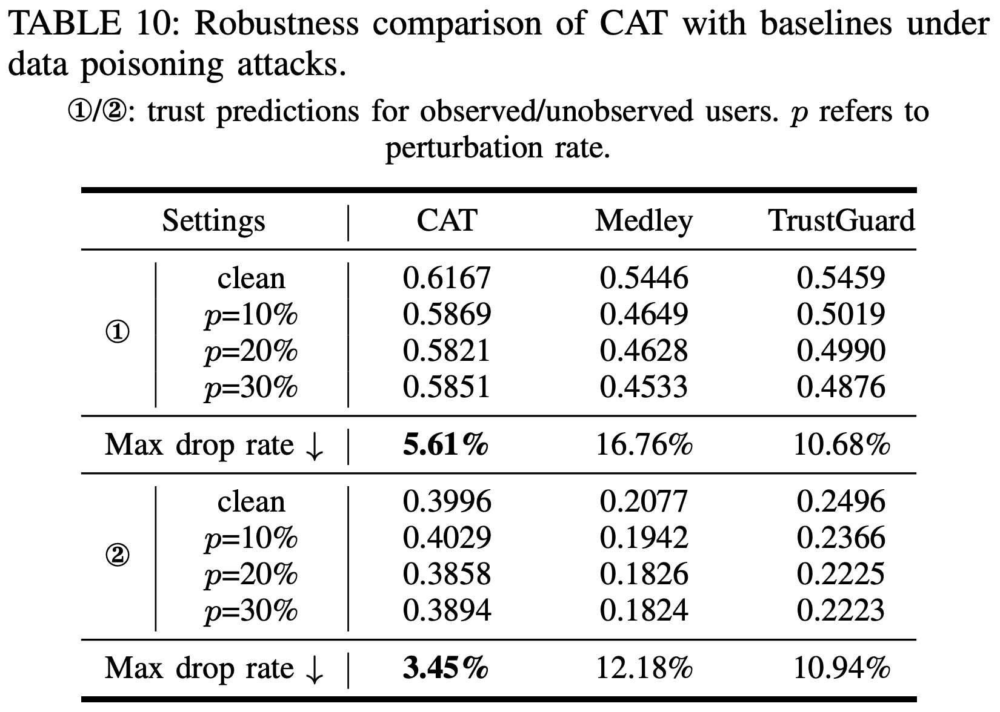

# CAT-Rebuttal

## C2: Additional baseline (409A&B&C)
### 1. Performance comparison with TrustGuard involved

### 2. Robustness comparison with TrustGuard involved

## C3: Improvement over baselines (409A&B&D)

## 409C_Response
### 1. LSTM generators: We use an LSTM to generate a context embedding by processing an unordered set of item embeddings within the same context.
### 2. MLP generators: We use an MLP to aggregate item embeddings with the same context, followed by an elementwise max-pooling operation to obtain a context embedding.

